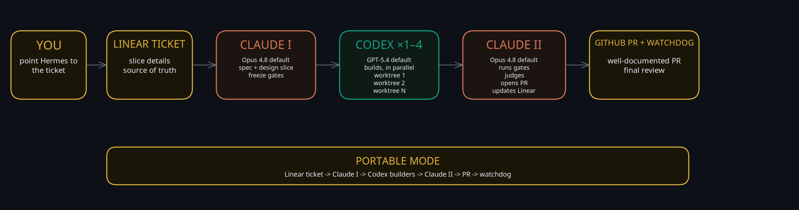
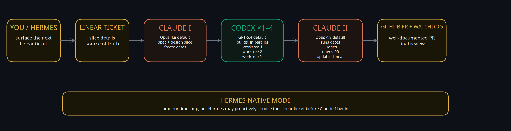

# architect-loop

**architect-loop separates judgment from execution.** Upstream used Claude
Fable for planning/review and GPT-5.5 Codex for implementation/research. In
this Hermes fork, those roles are configurable; the current defaults are
**Claude Opus 4.8** for architect/reviewer and **GPT-5.4** for
builder/researcher. Two Claude Code skills wire that split into a repo-centered
loop: specs and gates are written first, Codex works in fresh contexts, and the
architect reviews the evidence before anything is integrated. It runs on the
subscriptions you already have — no API keys required by default.

## Install (30 seconds)

```bash
git clone https://github.com/juanfpinzon/architect-loop
cd architect-loop && ./install.sh        # Windows: .\install.ps1
npm i -g @openai/codex@latest            # the builder (Codex CLI >= 0.133)
```

`./install.sh --project` installs to the current repo only instead of
globally. You need [Claude Code](https://claude.com/claude-code) on any paid
plan and the Codex CLI signed into a ChatGPT plan.

This fork still installs as a normal Claude Code skill bundle on a laptop.
The Hermes-specific docs are operating guidance layered on top, not a runtime
dependency.

There are two supported ways to use this fork:
- **Portable mode** — plain Claude Code + Codex on a laptop
- **Hermes-native mode** — the same loop with Linear, shared vault, Notion,
  and gh-watchdog layered on top

See [HERMES_OPERATING_MODEL.md](HERMES_OPERATING_MODEL.md) for the exact split.

## Use (two commands)

```
/architect                                      # the build loop
/architect-research <what you're considering>   # the research loop
```

`/architect` runs one work block: judge the last run, spec the next slice,
dispatch builders. `/architect-research` is for when you're still deciding
*what* to build — its cited report feeds the build loop's PRD.

## /architect


One short architect session per work block — judgment only, it never writes code:

- **Spec + gates first.** The architect specs a one-PR slice, splits it into 1–4
  lanes whose file sets are checked for overlap, and commits the acceptance gates to
  `docs/gates/` *before* any builder starts. Gates are read-only; a builder
  edit to a gate file fails the slice automatically.
- **Parallel isolated builders.** One fresh `codex exec` (xhigh) per lane,
  each in its own git worktree. Builders must argue with the spec before
  building (silent compliance = defect), build only their declared files,
  and report raw results — they do not have commit access in the sandbox.
- **The architect judges and integrates.** It runs the gate commands itself (builder
  claims are hearsay), reads the diff against the spec's intent (passing
  tests ≠ mergeable work), then commits and merges passing lanes. Judgment
  happens in a fresh session because the cited evidence favors fresh-context
  review.
- **The repo is the only memory.** `docs/HANDOFF.md` (a short table of
  contents, pruned every session), `docs/gates/`, `docs/lanes/`, git
  history. Not in the repo = didn't happen.
- **Supervision built in.** Liveness checks on dispatched runs, stall triage
  (diagnose the child process tree, kill the narrowest thing), explicit
  timeouts on every long command.

## /architect-research


Scout-first, like the production deep-research systems — no fixed lane
taxonomy:

- **A cheap Codex scout maps the topic** (~10 searches): canonical
  terminology, the load-bearing systems and papers, the named people, the
  topic's natural fault lines. Skipped for comparisons and fact-finds.
- **The architect designs 3–6 topic-specific lanes** from the scout's map, drawing
  per-source-class tactics from a library (academic citation snowballing,
  dependents-not-stars repo evidence, emerging-vs-hype gating, production
  pattern mining, expert tracking) — checked for overlap and gaps before
  dispatch.
- **Parallel Codex researchers** run under hard budgets: search caps, ≤5
  subjects per lane, saturation stop, strict findings discipline (URL + date
  + quote + confidence tag; NOT FOUND beats inference; no recommendations).
  Expert opinion runs as a second wave, roster-seeded by the first.
- **The architect verifies and writes.** ≥2 independent sources per load-bearing
  claim, adversarial falsification searches, citations only from URLs
  actually fetched — then one author writes one decision-oriented report.
  Gathering parallelizes; synthesis never does.

## Why this shape

Each design choice is source-backed (full citations in
[DESIGN.md](DESIGN.md)):

- Weak planners hurt more than weak executors — so the architect model does
  the design, and builders get explicit specs.
- Manager + worktree-isolated workers is a well-supported topology for
  shared-artifact software work; naive shared-file coordination collapses
  throughput.
- Frozen external gates beat trusting the agent — but agents game visible
  tests and their passing PRs are frequently unmergeable, so the architect
  also reads the diff.
- Memory files rot — so the handoff stays a short map, and detail lives in
  linked gate/lane files.
- The surveyed production deep-research systems use planner-designed
  decomposition rather than fixed lanes — so research lanes are designed per
  topic, after a scout pass.

## Hermes fork adaptation

This fork is being adapted to fit the Hermes operating model rather than using
upstream's "the repo is the only memory" rule verbatim.

- **Linear** stays the execution truth
- **shared vault** stays the durable cross-agent memory
- **Notion** stays the polished human-facing documentation layer
- **repo-local architect-loop files** stay slice-local execution artifacts
- **gh-watchdog** stays the downstream PR safety net
- **model roles** stay configurable, with Hermes defaults documented in
  [HERMES_MODEL_ROLES.md](HERMES_MODEL_ROLES.md)

The dual-mode usage contract for this fork lives in
[HERMES_OPERATING_MODEL.md](HERMES_OPERATING_MODEL.md).

### Portable mode workflow



Portable mode keeps the loop laptop-friendly, but it still starts from a
**Linear ticket**. You point Claude / Hermes to the slice, **Claude Opus 4.8**
handles **Claude I** work first: slice design + frozen gates. Then
**GPT-5.4** handles the parallel Codex build lanes. Then **Claude Opus 4.8**
returns as **Claude II** to run the gates, judge the result, prepare the PR,
and write back to Linear. Finally,
**gh-watchdog** performs the final PR review after the PR is raised.

### Hermes-native mode workflow



Hermes-native mode keeps the **same upstream architect loop and the same
model defaults**, but Hermes may proactively surface the Linear ticket and run
it inside the broader operating stack. The runtime path is still: **Linear
Ticket → Claude I (spec + freeze) → Codex builders → Claude II (gates +
judgment + PR + Linear update) → gh-watchdog final review**.

The editable Excalidraw source files for these diagrams live in
[`assets/portable-mode-flow.excalidraw`](assets/portable-mode-flow.excalidraw)
and [`assets/hermes-native-flow.excalidraw`](assets/hermes-native-flow.excalidraw).

The architecture and memory-routing contract for this fork lives in
[HERMES_ARCHITECTURE.md](HERMES_ARCHITECTURE.md).

## What's in the box

| File | What it is |
|---|---|
| [HERMES_OPERATING_MODEL.md](HERMES_OPERATING_MODEL.md) | Portable-mode vs Hermes-native operating contract and usage flow |
| [HERMES_ARCHITECTURE.md](HERMES_ARCHITECTURE.md) | Hermes-native owner-system and memory-routing contract for this fork |
| [HERMES_MODEL_ROLES.md](HERMES_MODEL_ROLES.md) | Hermes-native role-map contract, defaults, and configuration surface |
| [architect-loop.roles.example.yaml](architect-loop.roles.example.yaml) | Example project-level role-map template for future pilot repos |
| [DESIGN.md](DESIGN.md) | The design document — 12 enforced rules, failure-mode table, cited sources |
| [skills/architect/SKILL.md](skills/architect/SKILL.md) | The architect role: hard rules + procedure |
| [skills/architect/dispatch.md](skills/architect/dispatch.md) | Verified `codex exec` commands, builder block, worktree fan-out, stall triage |
| [skills/architect/research.md](skills/architect/research.md) | Slice-scale inline fact-check fan-out |
| [skills/architect/HANDOFF.template.md](skills/architect/HANDOFF.template.md) | The repo-memory file |
| [skills/architect-research/SKILL.md](skills/architect-research/SKILL.md) | Research orchestration: scout → design → fan out → verify → write |
| [skills/architect-research/lanes.md](skills/architect-research/lanes.md) | Scout block + source-class tactics library with verified endpoints |
| [tests/validate_skills.py](tests/validate_skills.py) | Repo sanity checks (frontmatter limits, links, fences) |

## FAQ

**Do I need API keys?** No. Claude Code runs on your Claude plan; Codex CLI
on your ChatGPT plan.

**What does a run cost?** Builder/researcher runs draw on your ChatGPT
plan's 5-hour and weekly quotas; a multi-hour run is a meaningful fraction
of a weekly window. Architect/reviewer sessions are minutes, not hours.

**What if a builder wrecks things?** Nothing reaches a branch until the
architect's tamper, boundary, and gate checks pass — worktrees are
discarded and re-dispatched from the freeze commit.

**Can I watch a run?** Yes — every dispatch prints the builder block, so you
can paste it into an interactive `codex` session with `/goal` instead.

**Why two skills?** Research-grade fan-out costs ~15× chat-level tokens — it
should be a deliberate act, not a side-effect of the build loop.

## Origin

The original idea came from [this X post by @jumperz](https://x.com/jumperz/status/2065454404623384859)
about using Fable with Codex subagents. I built architect-loop because I couldn't
find an easy way to run that pattern, and because it seemed useful to add a few
extra operational best practices on top of what Fable can already do when calling
Codex subagents.

## License

MIT
